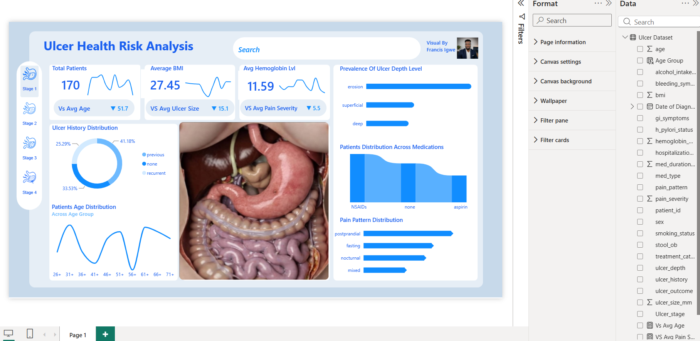

# Ulcer Health Risk Analysis Dashboard (Power BI)

An interactive Power BI report analysing ulcer patient data, covering patient demographics, ulcer stage and depth, symptom and pain patterns, and medication distribution.

## Report Overview

**Key Metrics**
- Total Patients
- Average BMI
- Average Hemoglobin Level

**Visual Breakdown**
- **Prevalence of Ulcer Depth Level** — bar chart of erosion, superficial, and deep ulcer levels
- **Ulcer History Distribution** — donut chart of previous, none, and recurrent history
- **Patients Age Distribution** — line chart across age groups
- **Patients Distribution Across Medications** — chart comparing NSAIDs, none, and aspirin
- **Pain Pattern Distribution** — bar chart of postprandial, fasting, nocturnal, and mixed pain patterns
- Stage navigator (Stage 1–4) for filtering by ulcer stage

## Tools & Techniques

- **Power BI Desktop** — data modelling, DAX measures, interactive report design
- Card visuals for headline KPIs
- Donut, bar, and line charts for distribution and trend analysis
- Page navigation buttons for filtering by ulcer stage

## Screenshots

## File

- `Ulcer_Patients_Analysis.pbix` — the full Power BI report file (open in Power BI Desktop)

## About This Project

Part of a data analytics portfolio built to demonstrate skills in data modelling, DAX, and dashboard design using Power BI.

